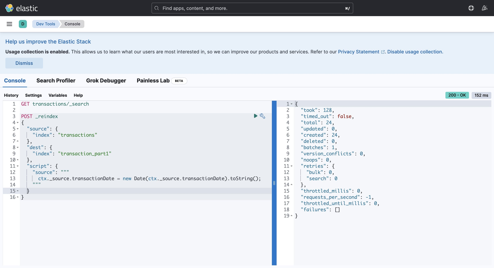

# Real-Time E-commerce Data Processing Platform

This project implements a scalable, real-time data processing platform for e-commerce applications. It captures, processes, analyzes, and visualizes customer interactions and transactions as they occur, enabling immediate insights and actions. By leveraging a modern event-driven architecture with Apache Flink at its core, the platform delivers sub-second data processing capabilities critical for modern digital retail operations.

## Why Flink ?

Apache Flink was chosen over PySpark Structured Streaming for this project due to its true real-time processing capabilities. While PySpark Structured Streaming operates in micro-batches (near real-time), Flink processes each record individually the moment it arrives.

Key advantages of Flink for our use case:
- **True stream processing**: Events are processed immediately upon arrival, not queued into micro-batches
- **Lower latency**: Critical for e-commerce applications where time-sensitive decisions drive customer experience and business outcomes
- **Stateful computations**: Flink's state management enables complex event processing across time windows without sacrificing performance
- **Exactly-once semantics**: Guarantees that each record is processed exactly once, even in failure scenarios

In an e-commerce environment where milliseconds matter (cart abandonment, personalized recommendations, fraud detection), Flink's processing model provides significant advantages over batch-oriented systems.

## System Architecture

The system architecture follows enterprise-grade patterns for real-time data processing in e-commerce environments:

1. **Data Generation Layer**: E-commerce platform APIs generate event data (page views, clicks, cart actions, purchases) in real-time as customers interact with the platform
2. **Message Queue Layer**: Apache Kafka topics serve as the central nervous system, ingesting and buffering all event streams
3. **Stream Processing Layer**: Apache Flink consumes data from Kafka topics, enriches, transforms, and processes events in real-time
4. **Persistence Layer**: Processed data flows into PostgreSQL for transactional storage and business operations
5. **Analytics Layer**: Data is continuously indexed into Elasticsearch for high-performance querying
6. **Visualization Layer**: Kibana dashboards provide real-time visibility into platform metrics and KPIs

This architecture ensures robustness, scalability, and low latency—essential qualities for production e-commerce applications where business decisions rely on up-to-the-second data.

## Key Services

### Apache Kafka
- Functions as the central message broker and event backbone
- Provides durable storage of event streams with configurable retention
- Enables decoupling of data producers from consumers
- Handles high-throughput data ingestion from web APIs

### Apache Flink
- Executes continuous real-time data processing
- Manages stateful operations for complex event processing
- Ensures exactly-once processing semantics
- Handles time-windowed aggregations for metrics calculation

### PostgreSQL
- Serves as the transactional database for processed events
- Maintains relational integrity for business entities
- Provides ACID guarantees for critical operations
- Enables complex queries for operational reporting

### Elasticsearch
- Indexes processed data for high-performance search and analytics
- Supports complex aggregations and faceted searches
- Enables fast time-series analysis across large datasets
- Provides near real-time visibility into platform metrics

### Logstash
- Handles data transformation and enrichment during ingestion to Elasticsearch
- Manages field mapping and data type conversions
- Handles timestamp normalization for time-series data
- Buffers data during Elasticsearch unavailability

### Kibana
- Delivers interactive visualization dashboards
- Provides real-time monitoring of business KPIs
- Enables ad-hoc exploration of e-commerce data
- Supports alerting on critical business thresholds

### Zookeeper
- Coordinates the Kafka cluster
- Manages broker leader election
- Stores configuration data
- Enables distributed synchronization

## Flink Job Data Processing

The core data processing logic is implemented in `DataStreamJob.java`, which orchestrates the real-time processing pipeline:

### Data Ingestion
The job begins by establishing a connection to Kafka using the FlinkKafkaConsumer, configured to consume from the specified topics containing e-commerce event data. The consumer is configured with:
- Exactly-once processing semantics
- Automatic offset commit management
- Deserialization of JSON messages to POJOs using custom deserializers

### Schema Mapping
The incoming data stream is mapped to strongly-typed domain objects defined in the DTO package:
- `OrderEvent`: Captures purchase transactions
- `ProductEvent`: Represents product interactions (views, add-to-cart)
- `UserEvent`: Tracks user browsing and session data

### Stream Processing Logic
The job applies several transformations to the raw event streams:

1. **Filtering**: Removes invalid or incomplete events based on business rules
2. **Enrichment**: Augments events with additional context (e.g., product categories, user segments)
3. **Windowing**: Applies time-based windows (5-minute sliding windows) to calculate real-time metrics
4. **Aggregation**: Computes key performance indicators like:
   - Conversion rates by product category
   - Average order value by user segment
   - Cart abandonment metrics
   - Product view-to-purchase ratios
   - Sales per transaction (calculating total monetary value, item count, and discount metrics)
   - Sales per day (using day-based tumbling windows with configurable timezone settings)
   - Sales per month (implementing custom window assigners for month boundaries and fiscal periods)
### State Management
The job maintains stateful operations for complex calculations:
- Uses Flink's managed keyed state to track user sessions
- Implements custom state TTL (Time-To-Live) policies to manage memory usage
- Leverages RocksDB as the state backend for durability

### Output

Processed results are written to multiple sinks:
1. PostgreSQL sink for transactional data using JDBC connector
2. Elasticsearch sink for analytics data using the Elasticsearch connector
3. Kafka sink for derived events that may trigger downstream processes

The job implements a custom monitoring framework that exposes processing metrics via Flink's metrics system, allowing operational visibility into throughput, latency, and backpressure.

### Sales Metrics Processing

The job incorporates specialized logic for critical sales metrics:

#### Per-Transaction Analysis

- Processes individual order events with their line items.
- Calculates transaction-level metrics like total value, tax, shipping costs, and margins
- Detects anomalous transactions through statistical outlier detection
- Tags transactions with promotion and discount attribution

#### Daily Sales Aggregation

- Implements 24-hour tumbling windows aligned to business days
- Computes daily sales totals by product category, region, and customer segment
- Maintains running comparisons to previous day, week, and year-over-year benchmarks
- Updates daily sales targets and variance metrics in real-time

#### Monthly Sales Reporting

- Uses calendar month and configurable fiscal period windows
- Builds hierarchical aggregations for product categories and geographic regions
- Computes month-to-date progress against forecasts and budgets
- Generates real-time month-end projections based on historical patterns and current trajectory

- These metrics are maintained in Flink's state and exposed both to the persistence layer and through a dedicated monitoring dashboard.

## ELK Dashboard

### Elasticsearch Configuration
Elasticsearch was configured with custom index templates to optimize for time-series e-commerce data:
- Defined custom mappings for event fields to ensure proper data typing
- Implemented date-based index patterns (`ecommerce-events-YYYY-MM-DD`) for efficient data lifecycle management
- Applied custom analyzers for text fields to improve search relevance for product names and descriptions
- Configured index lifecycle policies to manage hot/warm/cold data tiers based on age

### Data Reindexing Strategy

To optimize query performance, data was reindexed with the following approach:
- Normalized timestamps to UTC to ensure consistent time-based queries
- Created denormalized documents that combine related entities for faster retrieval
- Implemented custom index aliases that abstract the physical indices from queries
- Applied field-level optimizations like `doc_values` for frequently aggregated fields

### Logstash Pipeline
A custom Logstash pipeline handles the data flow from PostgreSQL to Elasticsearch:
1. JDBC input plugin polls PostgreSQL for new/updated records
2. Filter plugins normalize data formats and enrich events with additional context
3. Date filter standardizes all timestamps to ISO8601 format
4. Elasticsearch output plugin writes to date-based indices with optimized bulk operations

### Kibana Dashboards
Several purpose-built Kibana dashboards provide business visibility:
1. **Executive Overview**: High-level KPIs showing revenue, order volume, and conversion rates
2. **Product Performance**: Detailed metrics on product views, add-to-carts, and purchases
3. **User Journey Analysis**: Visualization of user paths through the site and conversion funnels
4. **Operational Monitoring**: Real-time metrics on system performance including event processing latency

The dashboards leverage Kibana's advanced visualization capabilities:
- Time-series visualizations for trend analysis
- Heatmaps for identifying peak shopping hours
- Geospatial maps for regional performance analysis
- Conversion funnels to identify drop-off points

Custom Elasticsearch queries power these visualizations, with optimized aggregations that leverage Elasticsearch's distributed computation capabilities for real-time analysis across massive datasets.