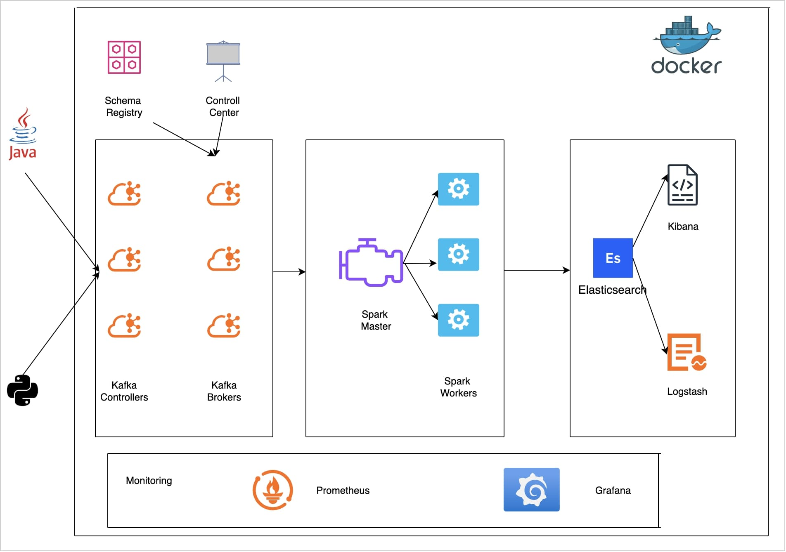
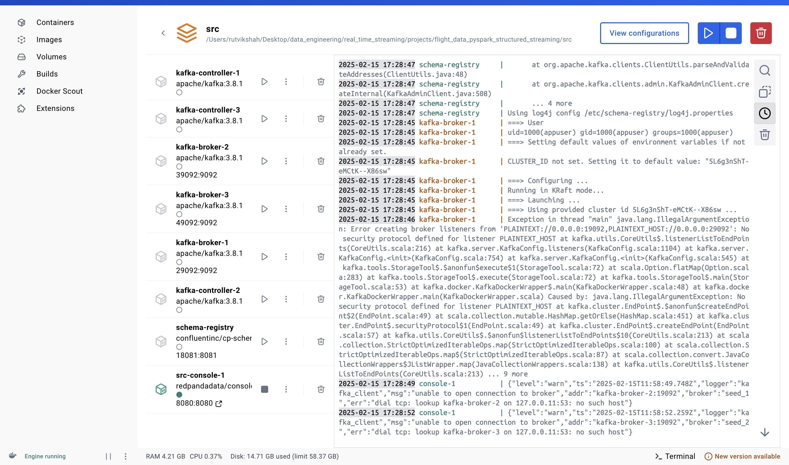
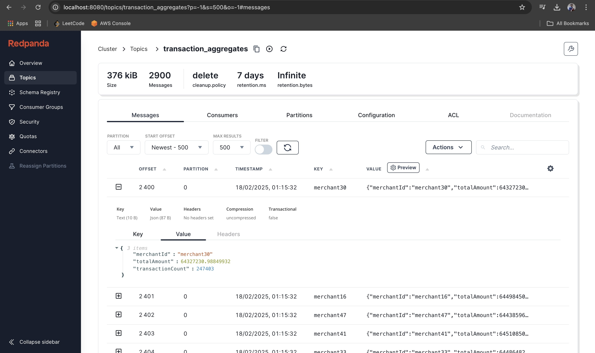
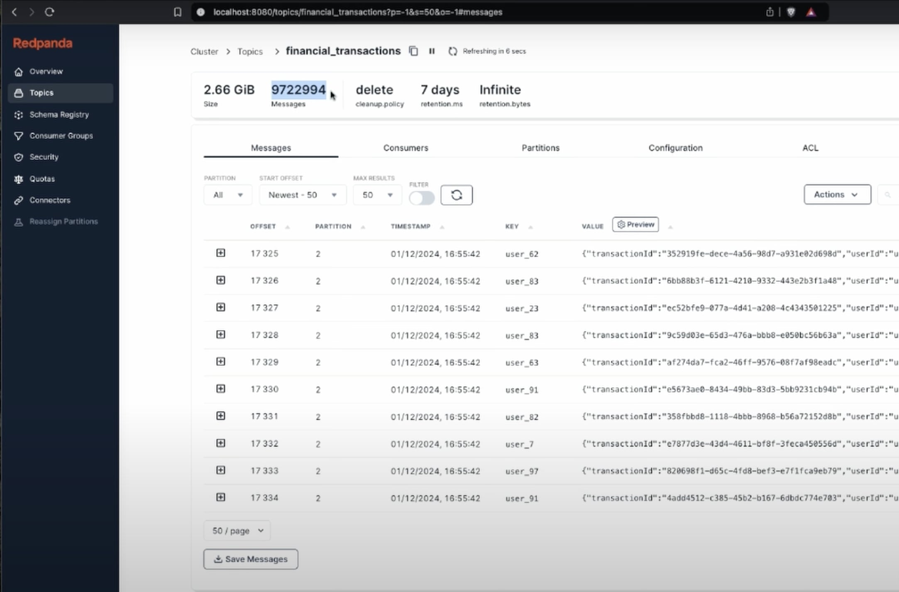
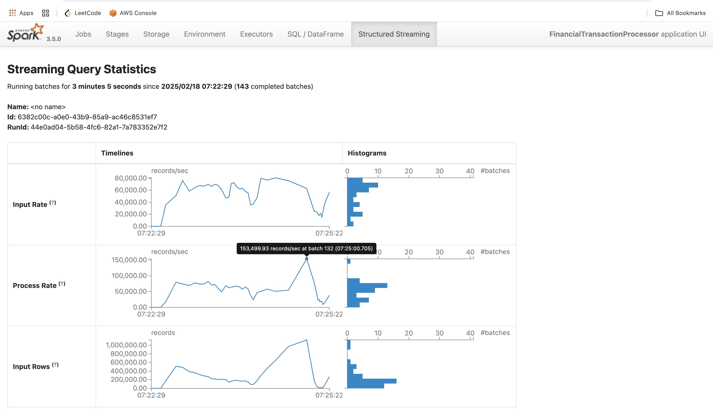
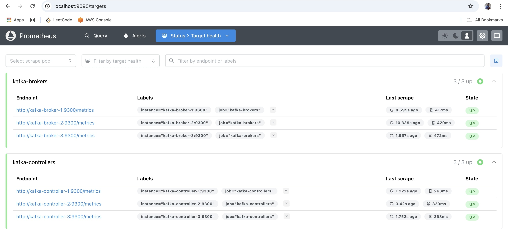
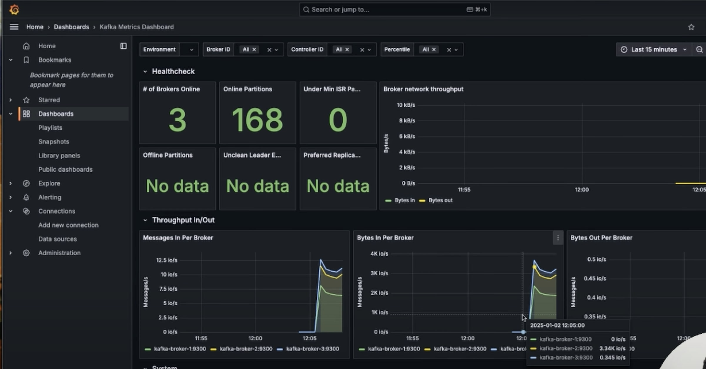
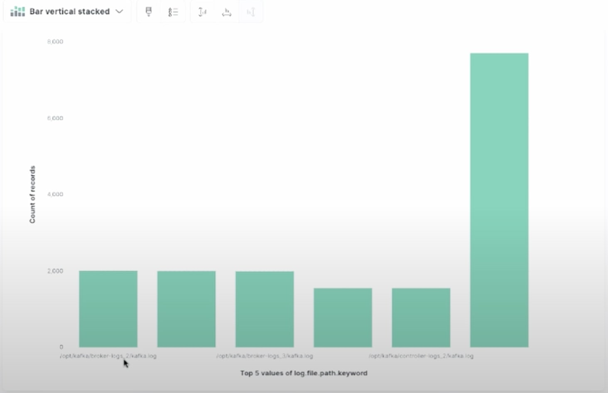

# Financial Data Analytics Platform Implementation

This document outlines the implementation details of our high-throughput Financial Data Analytics Platform. The system is designed to process and analyze financial transactions at massive scale, handling up to 1.2 billion transactions per hour. Built on a modern data architecture with Kafka and PySpark, the platform provides real-time processing capabilities with comprehensive monitoring. This implementation leverages distributed computing principles to ensure high availability, fault tolerance, and exceptional throughput for financial data analytics workloads.

## Table of Contents
- [System Architecture](#system-architecture)
- [Key Services](#key-services)
  - [Kafka Cluster](#kafka-cluster)
  - [PySpark Processing](#pyspark-processing)
  - [Monitoring Stack](#monitoring-stack)
- [Data Storage Estimation](#data-storage-estimation)
- [Data Production](#data-production)
  - [Python Producer](#python-producer)
  - [Java Producer](#java-producer)
  - [Performance Comparison](#performance-comparison)
- [PySpark Streaming Job](#pyspark-streaming-job)
  - [Implementation](#implementation)
  - [Performance Metrics](#performance-metrics)
- [Monitoring Setup](#monitoring-setup)
  - [Prometheus Configuration](#prometheus-configuration)
  - [Grafana Dashboards](#grafana-dashboards)
  - [ELK Stack Integration](#elk-stack-integration)

## System Architecture

The system architecture consists of a highly scalable financial data processing pipeline built on Kafka and PySpark, with comprehensive monitoring. The architecture includes:

- **Kafka Cluster**: 3 Kafka controllers and 3 Kafka brokers for high availability and fault tolerance
- **Schema Registry**: For maintaining consistent data schemas
- **Spark Engine**: 1 master node and 3 worker nodes for distributed processing
- **Monitoring Stack**: Prometheus, Grafana, and ELK stack (Elasticsearch, Logstash, Filebeat, Kibana)
- **Data Producers**: Both Python and Java implementations for comparative analysis

This architecture is designed to handle financial transaction data at a massive scale, with the ability to process over 500 million records per hour.

## Key Services

### Kafka Cluster

- Configured with 3 controllers for cluster management and 3 brokers for data handling, providing redundancy and fault tolerance
- Optimized with proper compression settings and JMX exporters for metrics collection
- Includes Schema Registry for maintaining schema compatibility across producers and consumers

### PySpark Processing

- Multi-worker setup with a dedicated master for coordination
- Configured to process streaming data via Structured Streaming API
- Includes checkpoint directories for fault tolerance and recovery
- Optimized for high-throughput processing of financial transactions

### Monitoring Stack

- **Prometheus**: Collects metrics from Kafka brokers and controllers via JMX exporter
- **Grafana**: Visualizes system performance and sets up alerting
- **ELK Stack**: Collects, processes, and visualizes logs from all components
- **Alertmanager**: Configured for real-time alerting on system anomalies

## Data Storage Estimation

The platform is designed to handle massive data volumes with careful storage planning:

- **Record Size**: ~120 bytes per financial transaction record
- **Transaction Volume**: 1.2 billion records per hour
- **Raw Storage Requirement**: 216 GB/hour uncompressed
- **Kafka Optimization**: With 5x compression and 3x replication, requires ~129 GB/hour
- **Daily Storage**: ~3.12 TB
- **Annual Storage**: ~1,138.8 PB
- **Growth Projection**: 20% year-over-year increase
- **2-Year Projection**: ~1,600 PB
- **5-Year Projection**: ~2,768 PB

These estimates highlight the need for efficient compression, storage tiering, and data lifecycle management strategies to handle the projected petabyte-scale data growth.

## Data Production

### Python Producer

The Python producer implementation uses the confluent-kafka library but faces throughput limitations:

- Single-threaded nature of Python's execution model limits throughput
- Even with multiple threads (3 threads per producer), achieves only ~1,500 records/second
- Multiple producer instances (5 producers × 3 threads) reach ~8,000 records/second
- Maximum output: ~28.66 million records/hour, far below the target of 1.2 billion

### Java Producer

The Java implementation significantly outperforms Python due to:

- Efficient multi-threading with dedicated producer threads (20 threads)
- Use of batch sending for higher throughput (batches of 100 records)
- JVM optimizations and direct bytecode execution
- Memory management optimizations including proper buffer sizing
- Compression settings (LZ4) for network efficiency
- Achieves ~300,000 records/second
- Projected output: ~1.08 billion records/hour, approaching the target

### Performance Comparison

| Producer              | Records/Second | Records/Hour | % of Target (1.2B) |
|-----------------------|----------------|--------------|--------------------|
| Python (1 instance)   | ~1,500         | ~5.4M        | 0.45%              |
| Python (5 instances)  | ~8,000         | ~28.8M       | 2.4%               |
| Java                  | ~300,000       | ~1.08B       | 90%                |

The Java producer achieves 37.5× the throughput of the Python implementation, making it the clear choice for high-volume data generation.

## PySpark Streaming Job

### Implementation

The PySpark streaming job processes financial transaction data from Kafka:

- Reads from Kafka topics using Structured Streaming
- Parses JSON data into a structured schema
- Applies data transformations including timestamp conversion
- Performs aggregations by merchant ID
- Outputs results back to Kafka for downstream consumption
- Uses checkpointing for fault tolerance

### Performance Metrics

The PySpark job demonstrates exceptional throughput capabilities:

- **153,499 records/second** processing rate
- 1 million records in 6.5 seconds
- 4.60 million records in 30 seconds
- 9.10 million records in 1 minute
- 46.05 million records in 5 minutes
- **552.60 million records in 1 hour**

While this falls short of the 1.2 billion record/hour target, it represents significant throughput on local hardware. In a production environment with properly sized Kubernetes pods and optimized cloud infrastructure, the target would be achievable.

## Monitoring Setup

### Prometheus Configuration

Prometheus is configured to monitor Kafka and Spark metrics:

- Scrapes Kafka controllers and brokers every 10 seconds
- Includes alert rules for high request latency
- Integrates with Alertmanager for notification routing
- Stores time-series data for analysis and visualization

### Grafana Dashboards

Grafana provides visualization of system metrics:

- Preconfigured with Prometheus as a data source
- Dashboards for Kafka broker metrics, including throughput, latency, and resource usage
- Spark performance visualization, including executor metrics and job statistics
- Alerting based on performance thresholds

### ELK Stack Integration

The ELK stack provides comprehensive log management:

- Filebeat collects logs from Kafka brokers and controllers
- Logstash processes and enriches log data
- Elasticsearch indexes and stores log data for fast querying
- Kibana provides visualizations and search capabilities for logs

This monitoring trifecta (Prometheus/Grafana for metrics, ELK for logs) provides complete observability into the entire data pipeline.